# Residential Sales CRM - Enterprise Integration Touchpoints & Data Flow Architecture
## Executive Pitch Call Reference & Technical Cheat Sheet

> **Audience**: Solution Architects, Enterprise IT Directors, SAP ERP Leads, and VP/Director of Sales.  
> **Purpose**: Instant, authoritative reference during executive pitch calls and technical due-diligence discussions for Tier-1 Residential Real Estate implementations (e.g., Bhartiya City / Nikoo Homes, Phoenix Mills, Sobha, Prestige).

---

## 1. High-Level Enterprise Integration Topology

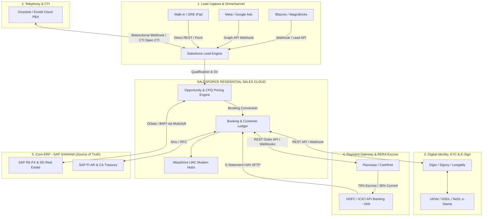

---

## 2. Master Integration Touchpoint Matrix

| # | Integration Touchpoint | External Software / Platform | Direction | Protocol / Architecture | Latency / Frequency | Status in Current Org |
| :---: | :--- | :--- | :---: | :--- | :--- | :---: |
| **1** | Property Portal Leads | **99acres / MagicBricks / Housing.com** | Inbound $\rightarrow$ SFDC | Webhook POST / Apex REST Endpoint | Real-time (< 2 sec) | **Ready Pattern** |
| **2** | Digital Ad Campaigns | **Meta Lead Ads (FB/Insta) & Google Ads** | Inbound $\rightarrow$ SFDC | Meta Graph Webhook / Google Ads API | Real-time (< 5 sec) | **Ready Pattern** |
| **3** | Cloud Telephony / CTI | **Ozonetel / Exotel Cloud Agent** | Bidirectional | WebRTC Open CTI + Webhook callbacks | Real-time streaming | **Active LWC Simulator** |
| **4** | Inventory Master Sync | **SAP S/4HANA (RE-FX Module)** | Bidirectional | OData v4 / RFC via MuleSoft | Nightly Batch + Delta Sync | **Active Controller & Mock** |
| **5** | Customer Master (BP) | **SAP S/4HANA (FI-AR / MDG)** | Bidirectional | BAPI `BAPI_BUPA_CREATE_FROM_DATA` | Real-time on Booking | **Active in Controller** |
| **6** | Sales Order Creation | **SAP S/4HANA (SD Module)** | SFDC $\rightarrow$ SAP | RFC `BAPI_SALESORDER_CREATEFROMDAT2`| Synchronous on Booking | **Active in Controller** |
| **7** | Digital KYC & PAN Check | **Digio / Signzy (NSDL / UIDAI Gateway)** | Bidirectional | REST API + Event Webhook | Real-time (< 10 sec) | **Active LWC Simulator** |
| **8** | E-Stamping & E-Sign | **Digio / Leegality (NeSL / CDSL)** | Bidirectional | REST API + Digital Signature Webhook | Asynchronous (Customer flow) | **Active LWC Simulator** |
| **9** | Payment Gateway (Token) | **Razorpay / Cashfree / PayU** | Bidirectional | Orders API + Webhook signature verification| Real-time (< 1 sec) | **Active LWC Simulator** |
| **10**| RERA Escrow & Bank H2H | **HDFC / ICICI Corporate Banking (VAN)** | Inbound $\rightarrow$ SFDC | MT940 / Host-to-Host SFTP / Webhook | Scheduled / Real-time VAN | **Active Reconciliation** |
| **11**| SAP Invoicing & Billing | **SAP S/4HANA (SD Billing / FI-AR)** | SAP $\rightarrow$ SFDC | IDoc `INVOIC02` / OData Service | On Civil Milestone Trigger | **Active in Ledger Hub** |
| **12**| WhatsApp / SMS Outreach | **Gupshup / Kaleyra / Infobip** | SFDC $\rightarrow$ External | WhatsApp Business API (Cloud REST) | Instant on Demand / Alert | **Ready Pattern** |

---

## 3. Deep-Dive: Touchpoint Architecture & Technical Working

---

### Touchpoint 1 & 2: Property Portals & Digital Marketing Lead Ingestion

#### Business Context
Over 60% of real estate inquiries originate from property portals (99acres, MagicBricks, Housing.com) and paid digital campaigns (Meta Ads, Google Performance Max). Speed-to-lead is critical: calling a buyer within 5 minutes increases qualification rates by 391%.

#### Data Flow & Technical Payload
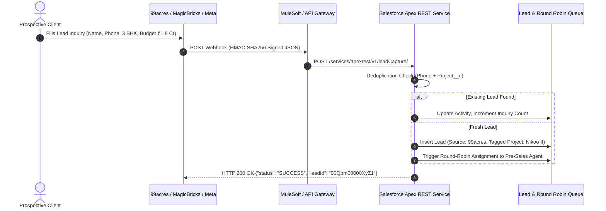

#### Working on the External Platforms
* **99acres / MagicBricks**: Provide developer webhooks where leads are pushed in real time. If direct webhooks fail, they offer an XML/JSON Lead Pull API polled every 5–15 minutes.
* **Meta Lead Ads**: Pushes lead gen payloads via Webhook subscriptions on the Facebook Page App. Requires generating a permanent Page Access Token and subscribing to `leadgen` events.
* **Deduplication Strategy**: In real estate, prospective clients often inquire on multiple portals for the same project. Our deduplication engine matches `MobilePhone` + `Project__c`. If an open lead exists within 30 days, it appends the new portal source as a campaign touchpoint rather than creating an orphan record.

---

### Touchpoint 3: Cloud Telephony & CTI (Ozonetel / Exotel)

#### Business Context
Pre-sales call centers handle hundreds of calls daily. Agents require single-click calling from Salesforce, automatic screen pops for inbound calls, and seamless call recording linkages for manager quality audits and AI summaries.

#### Data Flow & Technical Working
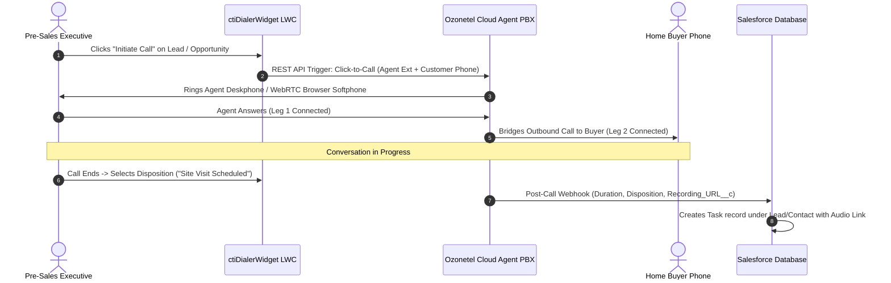

#### Working on the External Software (Ozonetel / Exotel)
* **Architecture**: Cloud PBX with WebRTC gateway. Uses two-legged bridging (Leg 1: Agent, Leg 2: Customer) so the builder's corporate virtual number (DID) is masked and displayed on the buyer's phone.
* **Storage Optimization**: Call recordings (MP3/WAV) are stored on Ozonetel's secure AWS S3 bucket. Only the **signed streaming URL** (`Recording_URL__c`) and metadata (duration, ring time, talk time, disposition) are sent to Salesforce. This prevents exhausting Salesforce file storage limits while keeping audio playable directly inside Salesforce.
* **AI Summarization**: The audio URL can trigger a downstream AWS Lambda / Python job that runs speech-to-text (Whisper) and passes the transcript to an LLM to auto-populate "Customer Budget", "Preferred Facing", and "Call Sentiment" on the Lead record.

---

### Touchpoint 4, 5, 6: SAP S/4HANA Core Integration (SD, RE-FX, FI-AR)

#### Business Context
In Indian enterprise real estate, **SAP is the legally binding single source of truth** for Inventory, Pricing Masters, Tax Invoices, and General Ledger accounting. Salesforce serves as the high-velocity Customer Engagement and CPQ Layer.

#### Complete Data Flow Across the 3 SAP Modules
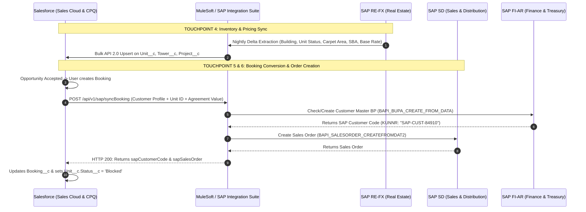

#### Working on the External Software (SAP S/4HANA)
* **SAP RE-FX (Real Estate Management)**: Manages architectural objects (`Architektonischer Raum`) and rental units (`Wirtschaftseinheit`). Contains master carpet area, RERA registration numbers, and base pricing condition tables (`KONV`).
* **SAP SD (Sales & Distribution)**: Generates the Sales Order (`VBAK`/`VBAP`) with item categories configured for real estate milestones (e.g., standard billing schedule `B`). When milestones are completed, SD generates standard Billing Documents (`VBRK`).
* **SAP FI-AR / Treasury**: Maintains Accounts Receivable customer sub-ledgers. Handles bank clearing entries against cash GL accounts and RERA Escrow accounts.
* **Why We Avoid Direct Point-to-Point**: Connecting Salesforce directly to SAP RFC/BAPIs creates brittle point-to-point spaghetti. We implement an API-Led connectivity layer using **MuleSoft** or **SAP Integration Suite (BTP)** with retry queues, circuit breakers, and payload transformation.

---

### Touchpoint 7: Digital KYC & ID Verification (Digio / Signzy)

#### Business Context
Under PMLA (Prevention of Money Laundering Act) and RERA mandates, developers must verify the identity and PAN of home buyers before booking confirmation. Fake PANs or misspelled names cause major re-registration legal penalties.

#### Data Flow & Working
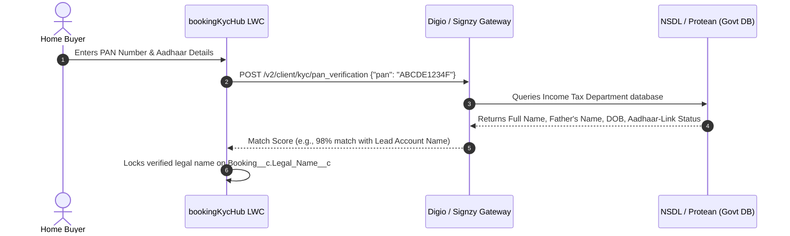

#### Working on the External Software (Digio / Signzy)
* **PAN Verification**: Connects to the Income Tax Department via NSDL Protean API. Verifies PAN validity, category (Individual vs Company), and returns the exact legal name registered with the government.
* **Aadhaar Verification**: Performs Paperless Offline e-KYC (XML) or Aadhaar OTP verification via UIDAI ASA/KUA licensed channels. Returns the verified address and photograph.
* **Audit Trail**: Digio returns a cryptographic verification certificate with timestamp and SHA-256 hash stored under Salesforce Files.

---

### Touchpoint 8: Digital E-Stamping & E-Sign (Digio / Leegality / NeSL)

#### Business Context
Executing a physical Builder-Buyer Agreement (BBA) traditionally requires buying physical stamp paper, booking appointments, and wet-signing hundreds of pages. Digital e-stamping and e-signing reduces execution time from **21 days to under 15 minutes**.

#### Data Flow & Working
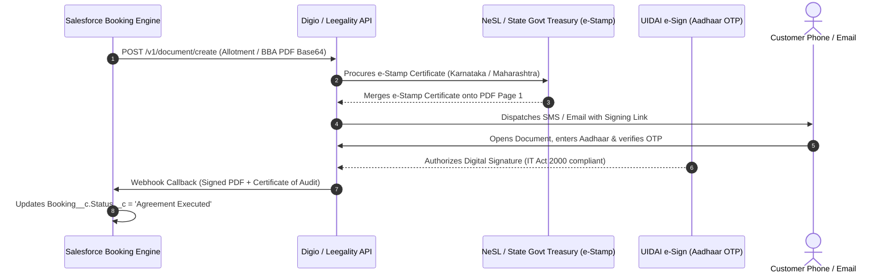

#### Working on the External Software
* **Digital E-Stamp Procurement**: Integrated with State Treasury portals via **NeSL** (National E-Governance Services Ltd) or SHCIL (Stock Holding Corporation of India). Procures stamp duty with a unique Certificate Number and 2D barcode.
* **Legal Admissibility**: Aadhaar-based e-Sign is legally valid under Section 5 of the Information Technology Act, 2000 and Section 65B of the Indian Evidence Act.
* **Audit Trail**: Generates a tamper-proof audit trail documenting IP address, OTP timestamp, device fingerprint, and certificate authority hash.

---

### Touchpoint 9 & 10: Payment Gateway & RERA Dual Escrow Banking (Razorpay & HDFC VAN)

#### Business Context
Under **RERA Section 4(2)(l)(D)**, builders cannot deposit 100% of customer collections into a general business account. Exactly **70% of collections must route directly into a designated RERA Project Escrow Account** (earmarked strictly for land and construction costs), while **30% routes to the developer's Operational Account**.

#### Technical Data Flow: Razorpay Smart Collect & Virtual Account Numbers (VAN)
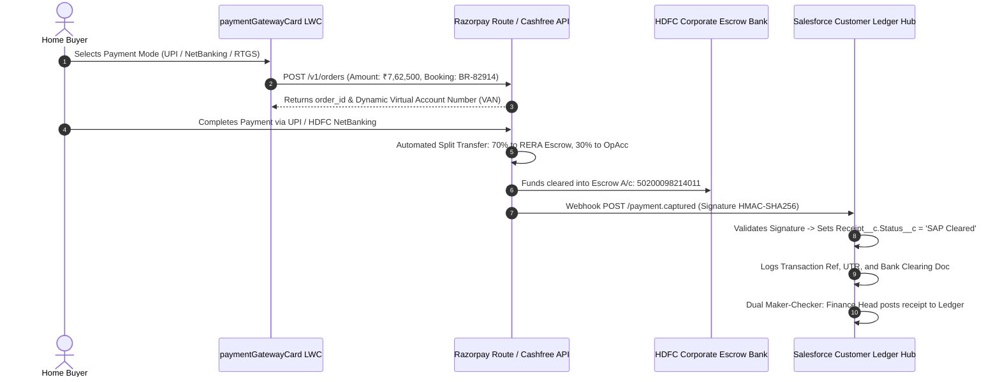

#### Working on External Banking & Gateway
* **Virtual Account Numbers (VAN)**: Every booking is assigned a unique alphanumeric virtual account (e.g. `NIKOO82914`). When a buyer does an NEFT/RTGS transfer from their bank, the funds hit the builder's pool account, and the bank auto-identifies the exact customer without any manual reconciliation or suspense account delays.
* **Host-to-Host (H2H) SFTP**: Banks (HDFC, ICICI, Axis) provide daily MT940 or encrypted CSV clearing statements uploaded to a secure SFTP server at 23:00 daily. Scheduled Apex polls this SFTP, parses UTR numbers, and reconciles pending receipts.

---

### Touchpoint 11: Bulk Civil Milestone Billing & SAP Invoice Generation

#### Business Context
When a construction milestone is reached (e.g., "Tower A - 5th Floor Slab Cast"), the builder must generate Demand Notes and SAP Tax Invoices for all 100+ active buyers in that tower simultaneously, complete with 18% GST calculation (or 0% for OC received) and 1% Section 194-IA TDS breakdown.

#### Data Flow & Working
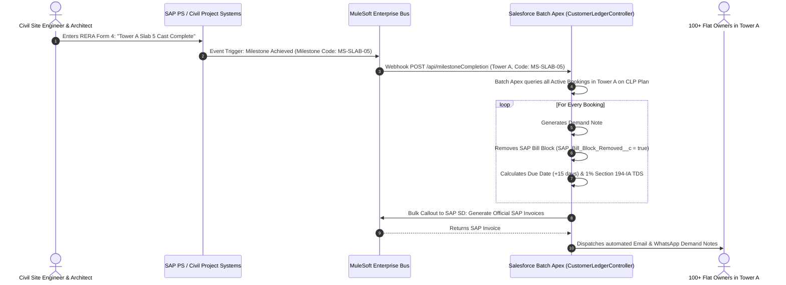

---

## 4. How to Handle Integration Questions in the Pitch Call

### Q1: "Who is the source of truth for Inventory and Pricing — Salesforce or SAP?"
> **Pitch Answer**:  
> *"SAP S/4HANA (specifically the RE-FX and SD modules) remains the single financial and legal source of truth for the company. Master inventory status, carpet area dimensions, and baseline square-foot rates originate in SAP.*  
> *Salesforce acts as the high-velocity Customer Experience and CPQ layer. Sales teams negotiate customized floor rise, parking, and approved discount schedules in Salesforce. Once a quote is accepted, Salesforce syncs the booking downstream to SAP to create the Customer Master BP and Sales Order. Inventory is locked instantly via our bi-directional trigger to eliminate double-booking risks."*

---

### Q2: "How do you prevent Salesforce file storage exhaustion with call recordings?"
> **Pitch Answer**:  
> *"We never store raw audio binary files inside Salesforce. Our CTI integration with Ozonetel/Exotel streams the call via WebRTC. When the call terminates, the audio file is stored in an encrypted AWS S3 bucket managed by the telephony provider.*  
> *Only the cryptographic signed URL (`Recording_URL__c`), call duration, agent timestamp, and disposition are logged against the Salesforce Task. Our LWC dialer streams the recording on-demand through an embedded player. This provides 100% compliance and audit readiness with 0 MB of Salesforce file storage consumed."*

---

### Q3: "How does the system ensure RERA compliance on escrow collections?"
> **Pitch Answer**:  
> *"We enforce statutory RERA Section 4(2)(l)(D) compliance through two layers:*  
> *1. **Payment Gateway Routing**: Our Razorpay/Cashfree integration uses automated route splitting to direct exactly 70% of collection proceeds directly into the project's designated RERA Master Escrow Bank Account and 30% into the Developer Operating Account.*  
> *2. **Dual Maker-Checker Governance**: Unlike generic CRMs where a single click approves a receipt, our architecture enforces a dual workflow: **Step 1 (SAP Treasury)** verifies bank credit and logs the SAP clearing document; **Step 2 (Finance Controller)** posts the credit to the customer ledger and releases the milestone. This guarantees complete financial auditability before any allotment letter or receipt certificate is issued."*

---

### Q4: "What happens if SAP is temporarily offline when a customer books a flat?"
> **Pitch Answer**:  
> *"We implement an asynchronous decoupled architecture using Salesforce Platform Events and MuleSoft message queues. If SAP is unreachable, the booking transaction in Salesforce does not fail.*  
> *The unit is immediately marked `Blocked` locally in Salesforce to prevent other agents from selling it. The sync payload is published to a durable MuleSoft Dead-Letter Queue (DLQ). Once SAP connectivity is restored, the queue replays the transaction, creates the SAP Sales Order, and feeds the SAP Customer ID back into Salesforce seamlessly."*

---

### Q5: "How does the system handle TDS on properties above ₹50 Lakhs?"
> **Pitch Answer**:  
> *"Under Section 194-IA of the Indian Income Tax Act, buyers purchasing property valued at ₹50 Lakhs or above must deduct 1% TDS and deposit it via Form 26QB to the government.*  
> *Our Customer Ledger Hub automatically detects when `Total_Booking_Amount__c >= 50,00,000`. On every milestone demand note, it displays the statutory 1% TDS withholding and the exact Net Amount Payable to the Builder. When the buyer uploads their Form 26QB challan acknowledgement, the Finance team verifies the BSR code and credits the TDS ledger bucket."*

---

## 6. Channel Partner (Broker) Portal Architecture & Onboarding Pipeline

### Executive Overview & Strategic Rationale

Tier-1 Indian developers (e.g. Godrej Properties, Lodha, Prestige, Bhartiya City / Nikoo Homes) rely on Channel Partners (CPs) for 50% to 75% of total residential gross booking value. However, managing 3,000 to 10,000 external brokers requires a carefully balanced **Hybrid B2B Architecture**:

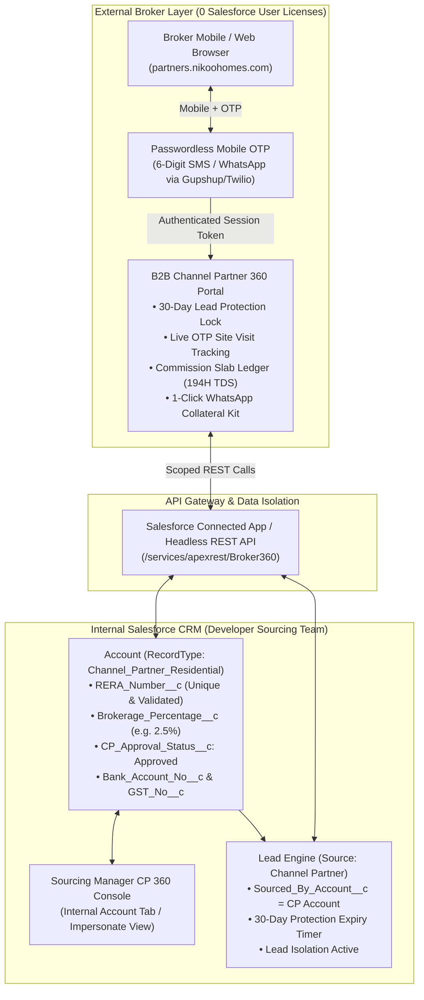

---

### Core Questions Addressed for Executive Demo & Client

#### Q1: "Where exactly is the URL provided to the broker?"
> **Pitch Answer**:  
> *"The broker accesses the portal via a branded developer subdomain (e.g., `https://partners.nikoohomes.com` or `https://cp.developer.com`).*  
> *The URL is delivered through three automated channels:*  
> *1. **Automated WhatsApp & SMS Welcome Kit**: The instant the Sourcing Manager approves the CP Account in Salesforce, an automated WhatsApp message is dispatched containing the broker's unique CP code, direct portal login link, and personal QR pass.*  
> *2. **Project Collaterals & QR Codes**: Physical broker meets, floor plan folders, and sales lounge stands have a QR code linking directly to the portal.*  
> *3. **Sourcing Manager Digital Card**: Every internal Sourcing Manager has a digital business card with a 1-click 'Register with Me' link tagging that broker to their sourcing portfolio."*

---

#### Q2: "How does the broker log into this portal? Do they log into Salesforce or click a button on the Account?"
> **Pitch Answer**:  
> *"External brokers **never log into Salesforce CRM**. Giving thousands of brokers Salesforce or Community licenses costs hundreds of thousands of dollars and creates unacceptable security liabilities.*  
> *Instead, the portal uses a **Passwordless Mobile + SMS OTP Authentication** flow:*  
> *1. The broker enters their 10-digit registered mobile number.*  
> *2. The backend matches the phone number against active `Account` records (`RecordType = Channel_Partner_Residential`).*  
> *3. A 6-digit OTP is delivered via SMS/WhatsApp (e.g., `742891`).*  
> *4. On entry, an authenticated session token is generated, scoped strictly to that broker's `Account.Id`.*  
> *For internal developer staff, the internal Salesforce Account page includes a **'Channel Partner 360'** Lightning tab so the Sourcing Manager can view the exact same telemetry and assist the broker."*

---

#### Q3: "Why did the client insist on an external site instead of internal Channel Partner 360 on the Account?"
> **Pitch Answer**:  
> *"There are four critical business reasons why every Tier-1 Indian developer mandates an external portal:*  
> *1. **Licensing Economics ($0 vs $1.5M/yr)**: Developers have 2,000 to 8,000 registered brokers. Partner Community licenses cost $15–$25 per user/month. Paying $50,000–$150,000 every single month for occasional broker logins is financially unviable. An external headless portal hitting Salesforce REST APIs costs $0 in user licenses.*  
> *2. **10-Second 30-Day Lead Protection Lock**: In competitive micro-markets (e.g. Bangalore North, Whitefield, Gurugram), speed of lead registration is everything. A broker sitting in a car at 10 PM must register a prospective client's phone number in 10 seconds to lock their 30-day sourcing protection before a rival broker pitches the same client. They will not navigate complex enterprise Salesforce UI.*  
> *3. **Zero-Trust Security & Lead Isolation**: Internal Salesforce holds PII data, cost sheets, competitor broker allocations, and developer margin rules. An external portal creates a hard security perimeter: a broker can only see leads tagged to their own CP ID.*  
> *4. **B2B Collateral & WhatsApp Selling Kit**: Brokers need instant access to approved RERA brochures, pricing slabs, and 1-click WhatsApp teasers to forward to prospective clients on their mobile devices."*

---

### The 4-Stage RERA-Compliant Broker Onboarding Pipeline

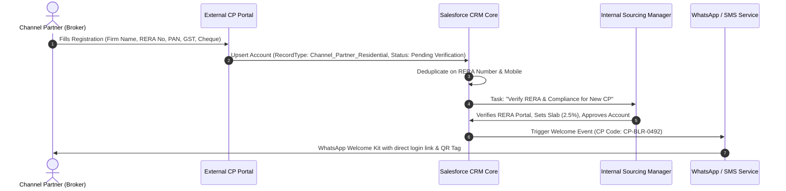

1. **Stage 1 (Digital Self-Registration)**: Broker submits Firm Name, Primary Contact, Mobile, Email, RERA Registration Certificate Number (mandatory under RERA Section 9), PAN, GSTIN, and Bank Account details for commission NEFT/RTGS.
2. **Stage 2 (Salesforce Ingestion & Deduplication)**: Upserts `Account` (`RecordType = Channel_Partner_Residential`) with status `Pending Verification`. Deduplicates on `RERA_Number__c` and `Phone` to prevent duplicate agency entries.
3. **Stage 3 (Compliance Verification & Slab Assignment)**: Sourcing Manager verifies RERA certificate validity on the state RERA portal (e.g. K-RERA / MahaRERA), confirms bank details, assigns the tier and commission slab (`Brokerage_Percentage__c = 2.5%`), and sets status to `Approved`.
4. **Stage 4 (Automated Welcome Kit & Activation)**: Automated WhatsApp message dispatched with direct portal login URL, unique CP code, and digital collateral kit.

---

### Touchpoint 13: Client Tagging & Broker Sourcing Protection Lifecycle (Portal vs. Salesforce Core)

#### What is "Client Tagging"?
In Indian residential real estate, **"Client Tagging"** (also known as *Lead Lock* or *Sourcing Attribution*) is the digital registration of a prospective client's mobile phone number under an authorized Channel Partner's RERA ID in the developer's CRM **before** the client visits the project site.

* **The Commission Exclusivity Window (30 to 60 Days)**: Once tagged, the prospective client is legally locked to that broker. Even if the client later visits the sales lounge alone or speaks to a different broker, the developer's Salesforce CRM guarantees commission attribution (2.0% – 3.0%) to the originating broker.
* **The Anti-Hoarding Rule (14-Day Mandatory OTP Site Visit)**: To prevent brokers from uploading raw directories or phone books without actual client interest, developers enforce an active validation milestone: the client must physically visit the sales lounge and verify their mobile number via an **SMS OTP** at the Welcome Desk within 14 days. If no OTP visit occurs, the tag expires and returns to the developer's open pool.

#### End-to-End Procedure: External Portal vs. Salesforce CRM Core

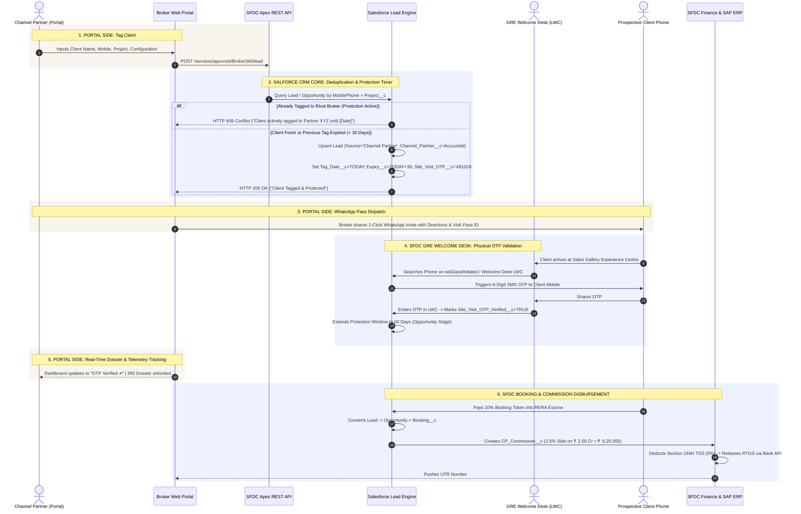

| Procedure Phase | Actions on External Portal (Broker Side) | Actions in Salesforce CRM Core (Developer Side) |
| :--- | :--- | :--- |
| **1. Client Tagging & Input** | Broker enters client name, mobile number, configuration (2/3/4 BHK), and project. Form does instant regex validation. | Apex REST validates payload, checks deduplication across all `Lead` and `Opportunity` records. Locks lead under broker's `Account.Id`. |
| **2. Exclusivity Timer** | Broker sees active countdown badge: *"Protected: 30 Days Remaining"*. | Workflow sets `Tag_Expiry_Date__c = TODAY() + 30`. Nightly scheduled batch checks for expired unverified tags. |
| **3. Client Invite & Pass** | Portal generates a digital WhatsApp pass with Google Maps pin, project specs, and unique Visit ID. | Salesforce stores generated `Site_Visit_OTP__c` and logs pre-sales outreach activity via CTI softphone. |
| **4. Site Visit Check-in** | Broker tracks attendance status. Once verified, badge turns to *"Site Visit Verified ✔"*. | GRE uses `wdGlassRelated` Welcome Desk LWC on iPad. Validates SMS OTP. Stamps `Site_Visit_OTP_Verified__c = TRUE`. Extends lock to 60 days. |
| **5. Offer & Negotiation** | Broker accesses live Dossier 360 to see approved concessions, floor-rise subsidies, and VP approval code. | Sales Manager uses CPQ Pricing Engine. System validates margin rules and generates official RERA Cost Sheet. |
| **6. Booking & KYC** | Broker views payment demand status and RERA escrow clearing notifications in real time. | Lead converts to `Opportunity` + `Booking__c`. Aadhaar/PAN e-KYC verified via Digio/Signzy integration. |
| **7. Commission Release** | Broker tracks commission slab (2.5%), TDS deduction (5% u/s 194H), and bank UTR transaction receipt. | Salesforce creates `CP_Commission__c`. Once Agreement is registered, Finance triggers automated RTGS disbursement via Bank Host-to-Host API. |

---

### Transaction 360 & Client Journey Dossier Architecture

When a Channel Partner reviews their pipeline or tagged bookings, clicking on any client or Booking ID (e.g. `BO-00000014`) opens the **Transaction 360 Dossier**. This replaces static rows with a live, 6-module audit trail:

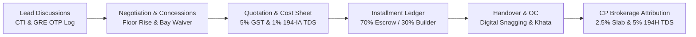

1. **Lead Activity Log**: Telephony call timestamps (Ozonetel CTI integration), GRE Welcome Desk SMS OTP verification observations, and WhatsApp brochure deliveries.
2. **Negotiation Summary & Approved Concessions**: Tracks standard rack price vs negotiated agreement value, floor rise subsidies, car parking concessions, and Sourcing VP sign-off token (`APPR-SOURCING-2026-081`).
3. **Quotation & Statutory Tax Transparency**: Carpet area vs super built-up, 5% RERA GST, mandatory 1% Section 194-IA TDS deduction notice (for properties > ₹50 Lakhs via Form 26QB), and 5.6% state stamp duty.
4. **Milestone Collections & RERA Escrow**: Tracks milestone demand notices, bank transaction references (MT940 clearing), statutory 70:30 account splitting, and official developer receipt numbers.
5. **Handover & Possession Readiness**: RERA construction completion %, Occupancy Certificate (OC) filing status with local authorities, 30-day pre-possession digital snagging timeline, and Sub-Registrar Khata registration schedule.
6. **CP Commission Payout Schedule**: Exact breakdown of earned brokerage (2.5%), statutory 5% Section 194H TDS deduction, disbursed installments with bank RTGS UTR codes, and pending finance approvals.

