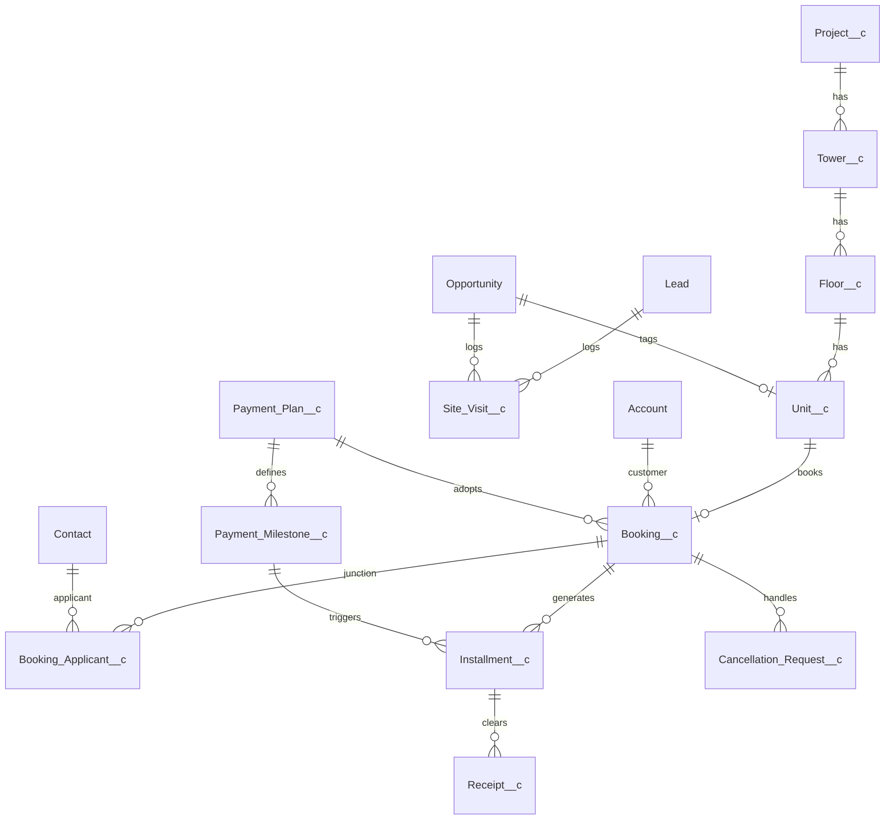

# Skill: Designing Scalable Salesforce Data Models

## Purpose
This skill equips AI agents and Salesforce architects with a repeatable, battle-tested methodology for conceptualizing, structuring, and documenting enterprise Salesforce schema architectures.

---

## 1. Relationship Decision Matrix: Master-Detail vs. Lookup

Choosing between Master-Detail and Lookup is the most critical architectural decision in a Salesforce data model. Use this decision matrix:

```
                          ┌───────────────────────────┐
                          │ Does the child record     │
                          │ have an independent life? │
                          └─────────────┬─────────────┘
                                        │
                         YES ───────────┴─────────── NO
                          │                          │
                          ▼                          ▼
              ┌───────────────────────┐  ┌───────────────────────┐
              │ Use LOOKUP            │  │ Does the parent need  │
              │ Relationship          │  │ Roll-Up Summary fields│
              └───────────────────────┘  │ or inherited security?│
                                         └───────────┬───────────┘
                                                     │
                                      YES ───────────┴─────────── NO
                                       │                          │
                                       ▼                          ▼
                           ┌───────────────────────┐  ┌───────────────────────┐
                           │ Use MASTER-DETAIL     │  │ Use LOOKUP with       │
                           │ Relationship          │  │ Flow/Apex rollups    │
                           └───────────────────────┘  └───────────────────────┘
```

| Criteria | Master-Detail (`MD`) | Lookup (`Lookup`) |
| :--- | :--- | :--- |
| **Record Lifecycle** | Child deleted if parent deleted (Cascade Delete). | Child survives parent deletion. |
| **Ownership & Security** | Child inherits parent's owner and sharing rules. | Child has its own independent owner and sharing rules. |
| **Roll-Up Summaries** | Supported natively (COUNT, SUM, MIN, MAX). | Requires custom Flow, DLRS, or Apex trigger. |
| **Record Locking** | Updating child locks the parent record (high risk of data skew locks). | Does not lock parent unless custom trigger enforces it. |
| **Limits** | Maximum 2 Master-Detail relationships per object. | Maximum 40 Lookup relationships per object. |
| **Real Estate Examples** | `Unit__c` $\rightarrow$ `Floor__c`<br>`Installment__c` $\rightarrow$ `Booking__c` | `Booking__c` $\rightarrow$ `Contact` (Customer)<br>`Lead` $\rightarrow$ `Project__c` |

---

## 2. Step-by-Step Data Modeling Workflow

### Step 1: Entity Discovery & Boundary Definition
1. Identify Core Business Entities:
   - What are the physical assets? (e.g., `Project__c`, `Tower__c`, `Floor__c`, `Unit__c`).
   - What are the commercial transactions? (e.g., `Opportunity`, `Booking__c`, `Installment__c`, `Receipt__c`).
   - What are the stakeholders/actors? (e.g., `Account` Customer/Broker, `Contact`, `Booking_Applicant__c`).
2. Distinguish Master Data vs. Transactional Data:
   - **Master Data**: Rarely changes (Project dimensions, Towers, Payment Plan templates).
   - **Transactional Data**: High velocity, time-stamped (Site visits, Bookings, Receipts).

### Step 2: Relationship & Cardinality Mapping
1. Map 1:Many hierarchies (e.g., 1 Project has Many Towers; 1 Tower has Many Floors; 1 Floor has Many Units).
2. Map Many:Many junctions (e.g., A Booking can have multiple Applicants, and an Individual Contact can be an applicant on multiple Bookings $\rightarrow$ Junction: `Booking_Applicant__c`).

### Step 3: Field Architecture & Naming Standards
- **API Naming Convention**:
  - Always use descriptive PascalCase with suffix `__c`: e.g., `Carpet_Area_SqFt__c`, `Base_Price__c`, `RERA_Registration_Number__c`.
  - Avoid ambiguous acronyms (e.g., use `Total_Booking_Amount__c` instead of `TBA__c`).
- **Data Type Selection**:
  - Currency fields: Always use native `Currency(16, 2)`.
  - Area / Dimensions: Use `Number(10, 2)`.
  - Percentages: Use `Percent(3, 2)` for milestone slabs.
  - Picklists: Use Restricted Picklists to prevent dirty data from APIs.
- **Formula Fields vs. Stored Fields**:
  - Use Formula fields for real-time calculations (e.g., `Total_Price__c = Base_Price__c + PLC_Amount__c + Floor_Rise_Amount__c`).
  - *Caution*: Cross-object formulas on millions of records cannot be indexed; if searching or filtering frequently on high-volume tables, use trigger/flow persistence instead.

### Step 4: Guarding Against Data Skew & Performance Bottlenecks
1. **Parent-Child Skew (> 10,000 children per parent)**:
   - Never attach > 10,000 child records to a single parent record in a Master-Detail relationship to avoid concurrency locks.
   - For high-volume log items (e.g., `Integration_Log__c`), use a Lookup or decouple without parent locking.
2. **Account Ownership Skew**:
   - Never assign > 10,000 Account records to a single Salesforce user. Distribute ownership across system integration users or regional sales managers.
3. **Indexing High-Volume Fields**:
   - Mark external identifiers as `External ID` (e.g., `SAP_Customer_Code__c`, `SAP_Material_Code__c`). Salesforce automatically creates a b-tree database index for External ID and Unique fields.

---

## 3. Reference Architecture: Residential Real Estate Schema



---

## 4. Delivery Checklist for AI Agents
When generating or reviewing an object model:
- [ ] Are all master-detail relationships justified by cascade-delete or rollup needs?
- [ ] Are all lookup relationships configured with clear deletion rules (Clear value vs Restrict)?
- [ ] Are External IDs defined for any fields synced with ERP (SAP/Oracle)?
- [ ] Is Field History Tracking activated for sensitive financial and status fields?
- [ ] Is an ER diagram (Mermaid) generated to validate relationships visually?
