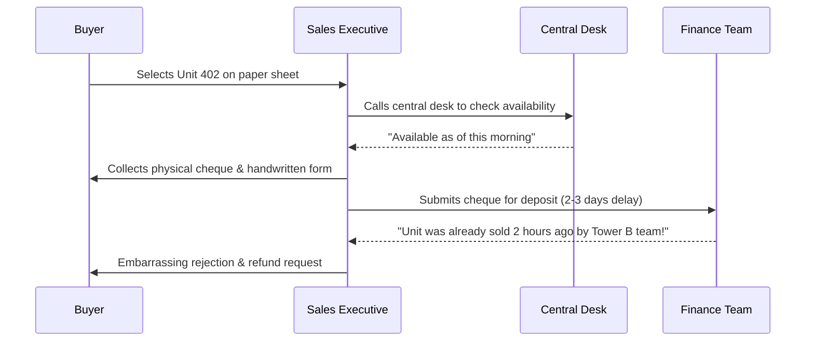

# Skill: Enterprise Discovery, Process Mapping & Requirements Analysis

## Purpose
This skill equips AI agents, solution architects, and business analysts with an end-to-end framework to conduct technical discovery, interview key stakeholders, map As-Is vs. To-Be workflows, identify architectural gaps, and produce actionable user stories with rigorous acceptance criteria.

---

## 1. Discovery Lifecycle & Intake Framework

```
[Phase 1: Domain Discovery]
       │  - Business model, project portfolios, geographic regulations (RERA, DPDP)
       ▼
[Phase 2: Stakeholder Personas & Interviews]
       │  - Pre-sales, Direct Sales, CRM Ops, Finance Controller, Channel Partners
       ▼
[Phase 3: As-Is Process Mapping & Bottleneck Identification]
       │  - Manual Excel handoffs, pricing discrepancies, delayed receipts
       ▼
[Phase 4: To-Be Architectural Vision]
       │  - Real-time inventory grid, automated cost sheet, dual maker-checker reconciliation
       ▼
[Phase 5: User Stories & Technical Backlog Specification]
          - INVEST criteria, Gherkin (Given/When/Then) acceptance criteria
```

---

## 2. Stakeholder Persona Interview Playbooks

### Persona 1: Pre-Sales & Telecalling Lead
- **Current Frustrations**: Leads arriving from multiple property portals (99acres, MagicBricks, Meta) take hours to be assigned; high lead leakage.
- **Key Discovery Questions**:
  1. What is the current Average Speed-to-Call (ASTC)?
  2. How do you distinguish between duplicate enquiries from the same buyer across portals?
  3. What are the mandatory qualification criteria before booking an in-person Site Visit?

### Persona 2: Direct Sales Executive / Site In-Charge
- **Current Frustrations**: Walking buyers around a sales gallery while relying on printed floor sheets; risk of double-booking units across sales managers.
- **Key Discovery Questions**:
  1. How long can a unit remain in a temporary "Soft Hold" or "Blocked" status before automatic expiration?
  2. How do you calculate Floor Rise, Preferred Location Charges (PLC), and club house charges? Are discounts discretionary or tier-governed?
  3. What document is handed over upon token payment?

### Persona 3: Post-Sales CRM Operations
- **Current Frustrations**: Collecting paper KYC documents (PAN, Aadhaar), chasing co-applicants for signatures, manually tracking construction milestone demand notices.
- **Key Discovery Questions**:
  1. How many co-applicants can be registered on a single unit?
  2. What is the SLA between receiving milestone completion from civil engineers and dispatching statutory demand letters?
  3. What is the standard cancellation forfeiture policy?

### Persona 4: Finance Controller & Accounts
- **Current Frustrations**: Bank accounts inundated with NEFT/RTGS payments with ambiguous buyer references; reconciling RERA 70:30 escrow compliance manually.
- **Key Discovery Questions**:
  1. What is the interest rate applied to overdue installments (e.g., 18% p.a. simple interest)?
  2. How are 1% TDS (Section 194-IA) and GST (0% OC vs 5% Under-Construction) handled on cost sheets?
  3. What ERP acts as the financial book of record (SAP S/4HANA FI/RE-FX)?

---

## 3. As-Is vs. To-Be Process Mapping

### Scenario: Unit Selection & Booking Flow

#### As-Is (Manual & Error-Prone)


#### To-Be (Automated Salesforce CRM)
```mermaid
sequenceDiagram
    participant Buyer
    participant LWC as LWC Inventory Explorer
    participant SF as Salesforce CRM Engine
    participant Gateway as Razorpay / Escrow Gateway
    participant SAP as SAP S/4HANA

    Buyer->>LWC: Explores real-time 3D floor plate & selects Unit 402
    LWC->>SF: Atomic Soft-Lock (15-min reservation hold)
    SF-->>LWC: Reservation confirmed; Cost sheet generated with GST/TDS
    Buyer->>Gateway: Completes instant token payment (UPI/Netbanking)
    Gateway-->>SF: Webhook confirms receipt; Unit status flips to Sold
    SF->>SAP: Async Queueable syncs customer & contract
    SF-->>Buyer: Auto-dispatches digital booking receipt & allotment letter
```

---

## 4. Gap Analysis & Architecture Trade-Offs

| Requirement | Declarative (Flow / Standard) | Custom Code (Apex / LWC) | Architectural Recommendation |
| :--- | :--- | :--- | :--- |
| **Lead Routing** | Standard Lead Assignment Rules | Custom Round-Robin Apex | **Flow / Assignment Rules** unless complex agent capacity weighting is required. |
| **Inventory Grid UI** | Standard Related Lists | Custom LWC Matrix Component | **Custom LWC** required for interactive color-coded floor plate visualizer. |
| **Pricing Calculation** | Standard CPQ / Formula Fields | Custom Pricing Engine Apex | **Custom Apex Service** for complex multi-variable pricing (Floor rise, PLC, statutory TDS, GST rules). |
| **Receipt Reconciliation** | Standard Approval Process | Custom Screen Flow + Approval | **Screen Flow + Standard Approval Process** for dual maker-checker governance. |

---

## 5. User Story Specification Framework (INVEST Standard)

Every user story must follow the **INVEST** principle (Independent, Negotiable, Valuable, Estimable, Small, Testable) and use Gherkin format acceptance criteria:

### Example User Story: Real-Time Unit Reservation
- **ID**: `US-RES-104`
- **As a**: Direct Sales Executive conducting a site tour
- **I want to**: Temporarily lock an available unit for 15 minutes directly from the interactive floor plate LWC
- **So that**: Other sales executives across sales lounges cannot sell the same unit while my customer reviews the cost sheet

#### Acceptance Criteria (Gherkin):
```gherkin
Scenario: Successful Unit Soft-Hold
  Given a unit in Tower A with Status "Available"
  When the Sales Executive clicks "Hold Unit" and selects Duration "15 Minutes"
  Then the unit Status changes immediately to "Blocked"
  And a countdown timer appears on the Unit Card
  And any other sales user viewing the floor plate sees the unit as "Blocked (Hold)"

Scenario: Hold Expiration
  Given a unit with Status "Blocked" under an active 15-minute timer
  When the timer reaches 00:00 without a confirmed booking token receipt
  Then the unit Status automatically reverts to "Available"
  And a toast notification informs the sales executive that the hold has expired
```
