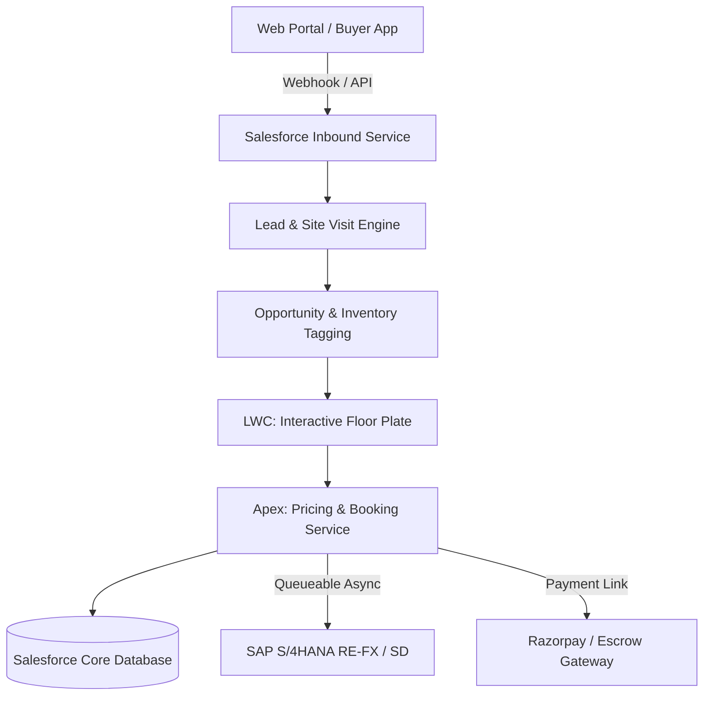

# Technical Solution Design Document (TDD) Template

# Project / Feature Title: [Feature Name or Project Milestone]

| Document Attribute | Value |
| :--- | :--- |
| **Author / Lead Architect** | [Name / AI Agent] |
| **Reviewers / Stakeholders**| [Architects, Tech Leads, Product Owner] |
| **Version** | `1.0.0` |
| **Status** | `Draft` \| `Under Review` \| `Approved` |
| **Last Updated** | [YYYY-MM-DD] |

---

## 1. Executive Summary & Business Problem
- **Problem Statement**: [What manual inefficiency, data fragmentation, or business blocker are we solving?]
- **Proposed Solution**: [High-level summary of the Salesforce architectural implementation]
- **Target Value / KPIs**:
  - Reduction in cycle time from booking to allotment letter.
  - 100% elimination of double-booked units across sales lounges.
  - Zero manual discrepancy in overdue interest calculation.

---

## 2. High-Level Architecture Diagram


---

## 3. Personas & Scope Boundary

| Persona | Key Interaction Points | Critical Permissions |
| :--- | :--- | :--- |
| **Sales Executive** | Unit exploration, Soft hold, Booking creation | Pre-Sales & Sales Permission Set |
| **CRM Officer** | Applicant KYC review, Demand notice dispatch | CRM Operations Permission Set |
| **Finance Controller** | Receipt reconciliation, Discount sign-off | Finance Controller Permission Set |

---

## 4. Data Architecture & Schema Changes
*(Reference specific schema details in [Object Schema Template](file:///c:/Users/Admin/Documents/Residential%20Sales%20Project/salesforce-ai-framework/templates/object-schema-template.md))*

- **New Custom Objects**: `[List new objects, e.g., Booking__c, Installment__c]`
- **Modified Objects**: `[List existing standard/custom objects]`
- **Key Relationships & Cascades**: `[Master-detail vs Lookup justifications]`

---

## 5. Automation & Business Logic Architecture
Detail the declarative vs. programmatic distribution:

```
┌────────────────────────────────────────────────────────┐
│                   Automation Layer                     │
├─────────────────────┬──────────────┬───────────────────┤
│ Component           │ Tech Type    │ Trigger Condition │
├─────────────────────┼──────────────┼───────────────────┤
│ Soft Hold Expiry    │ Flow (Sched) │ Timer > 15 mins   │
│ Pricing Engine      │ Apex Service │ On Unit Selection │
│ Schedule Generation │ Apex Trigger │ On Booking Create │
│ Receipt Approval    │ Approval Proc│ On Receipt Submit │
└─────────────────────┴──────────────┴───────────────────┘
```

---

## 6. User Experience & LWC Hierarchy
- **Primary Component Bundle**: `[e.g., residentialBookingWizard]`
- **Design System Compliance**:
  - Theme: WarpDrive Strict Light Mode (`#FFFFFF` container, `#F8FAFC` canvas).
  - Primary Accent: `#00A859` Emerald Green with pill buttons (`border-radius: 9999px`).
  - Mint Badges: `#ECFDF5` background with `#065F46` forest text.
- **Component Decomposition**:
  - `headerCard`: Progress path and tagged unit summary.
  - `applicantAccordion`: Multi-applicant capture and Aadhaar/PAN fields.
  - `paymentPlanSelector`: Interactive milestone schedule preview.
  - `actionFooter`: Pill buttons with real-time validation guards.

---

## 7. Integration & Interface Specifications
| Integration Name | Target System | Direction | Protocol | Auth Type | Error Handling Strategy |
| :--- | :--- | :--- | :--- | :--- | :--- |
| **Inventory Sync** | SAP RE-FX | Inbound | REST / OData | Named Credential (OAuth) | Nightly reconciliation batch |
| **Contract Booking**| SAP SD | Outbound | REST JSON | Named Credential (mTLS) | Queueable retry with DLQ |
| **Payment Webhook** | Razorpay / Escrow | Inbound | Webhook | HMAC-SHA256 Secret | Idempotency log verification |

---

## 8. Security, Governance & Compliance
- **Sharing Posture**: `with sharing` enforced on all custom Apex services.
- **Database Access**: All SOQL queries include `WITH USER_MODE`; all DML uses `as user`.
- **Statutory / PII Protections**:
  - Masked Aadhaar storage (`XXXXXXXX1234`).
  - Dual maker-checker enforcement for financial receipt approvals.

---

## 9. Performance & Large Data Volume (LDV) Defense
- **Governor Limit Safeguards**:
  - All selectors query strictly with selective index filters (`IN :setOfIds`).
  - Batch Apex chunks capped at 200 records.
- **Data Skew Prevention**:
  - Child objects to parent records capped below 10,000 to prevent row locking.

---

## 10. Quality Assurance & Test Strategy
- **Coverage Target**: 90%+ with 100% assertion coverage.
- **Key Test Cases**:
  1. *Positive Path*: Full booking from tagged unit through down payment.
  2. *Negative Path*: Attempting to book an already sold unit (expect `BookingException`).
  3. *Bulk 200 Records*: Simultaneous batch booking execution without governor exceptions.
  4. *Mock Callouts*: External HTTP callouts mocked with 200 OK and 500 Failure.

---

## 11. Release & Deployment Plan
1. Pre-Deployment: Run all Apex tests in source sandbox.
2. Metadata Deployment: Deploy Custom Objects $\rightarrow$ Apex Classes $\rightarrow$ Flows $\rightarrow$ LWCs $\rightarrow$ Permission Sets.
3. Post-Deployment: Assign permission sets to pilot users and seed master data.
